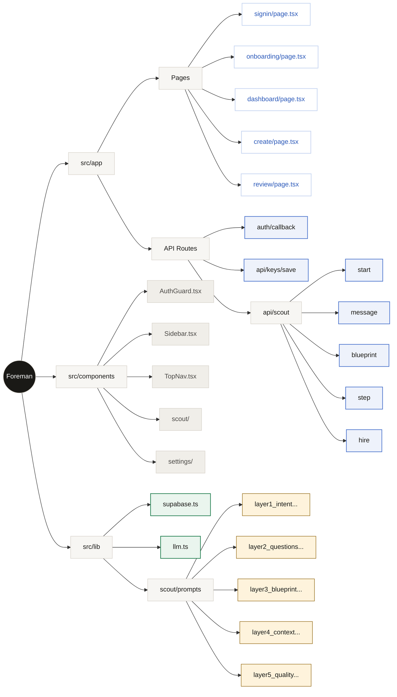
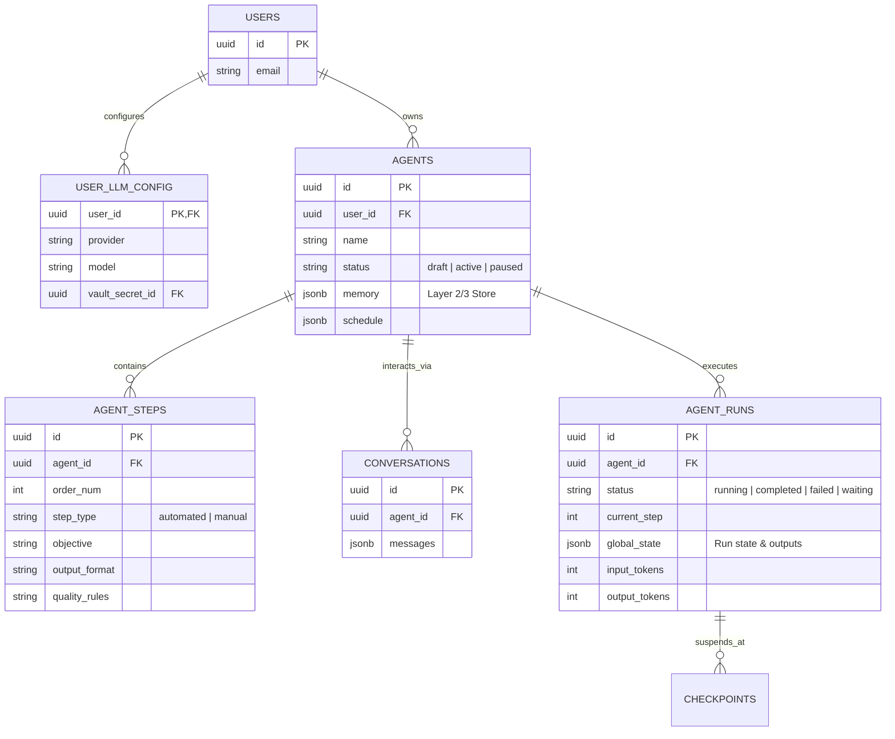

# Foreman Codebase Architecture

This document visualizes the physical structure of the codebase mapped to its corresponding application boundaries, routing, and database schema representations.

## Physical Codebase Map

## Database Schema Model (supabase/migrations)

