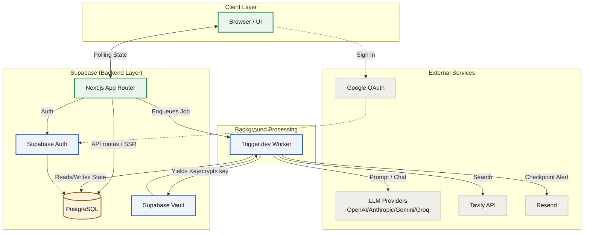
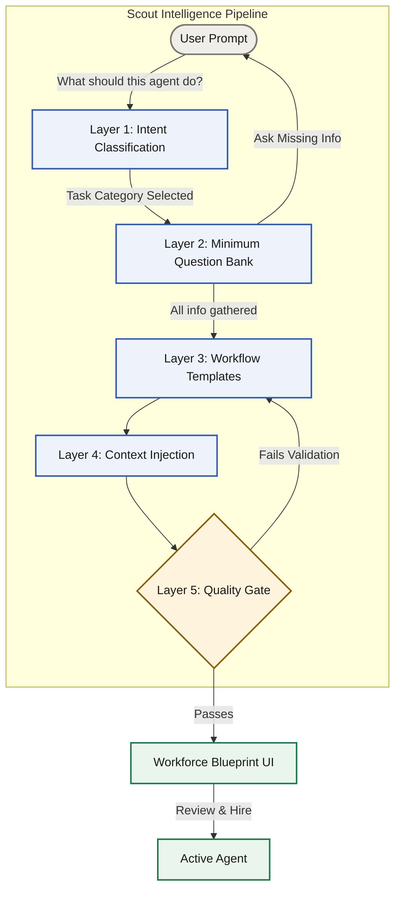
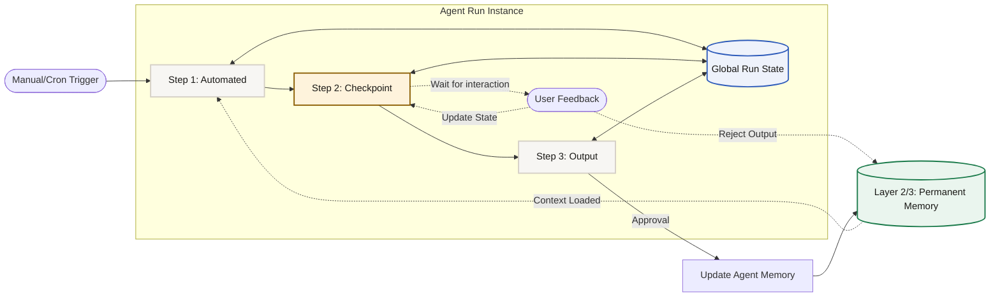

# Foreman System Architecture

This document provides a visualization of the Foreman system architecture, mapping out the relationships between the frontend, backend, third-party services, and the core agent orchestration engine (Scout).

## High-Level System Architecture

## Scout Agent Creation Pipeline (5-Layer Architecture)

## Execution Engine & Memory Flow

